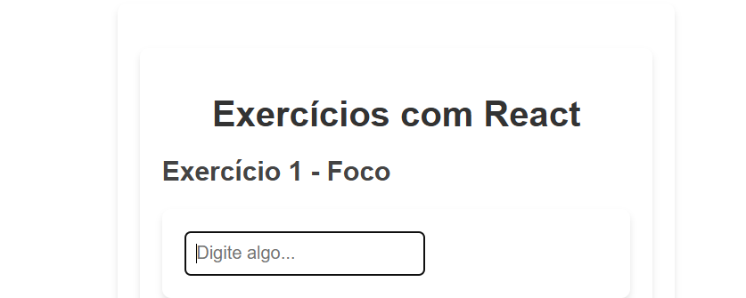
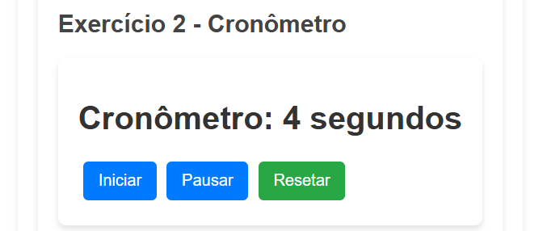
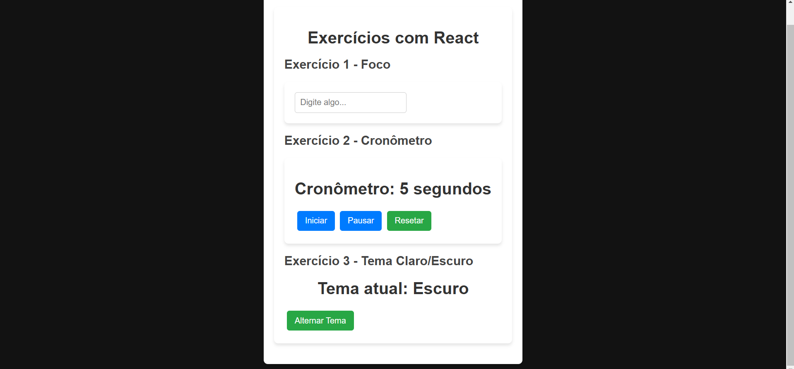

# React Exercises: Foco, Cronômetro e Tema

Este repositório contém três exercícios básicos desenvolvidos em React para praticar conceitos como `useRef`, `useContext`, e manipulação de estados e estilos dinâmicos.

## 📋 Exercícios

### 1. **Foco em um Input**

- **Descrição**: Um componente que permite focar automaticamente em um campo de entrada ao clicar em um botão.
- **Conceito Utilizado**: `useRef` para manipular diretamente o DOM e usar o método `focus()`.

### 2. **Controlando um Cronômetro**

- **Descrição**: Um cronômetro que conta os segundos e pode ser iniciado, pausado e resetado.
- **Conceito Utilizado**: `useRef` para armazenar a referência de `setInterval` e `clearInterval`.

### 3. **Contexto de Tema**

- **Descrição**: Um sistema que alterna entre tema claro e escuro para a aplicação.
- **Conceito Utilizado**: `createContext`, `useContext` e manipulação de classes dinâmicas para estilização.

### Claro:

### Escuro:

